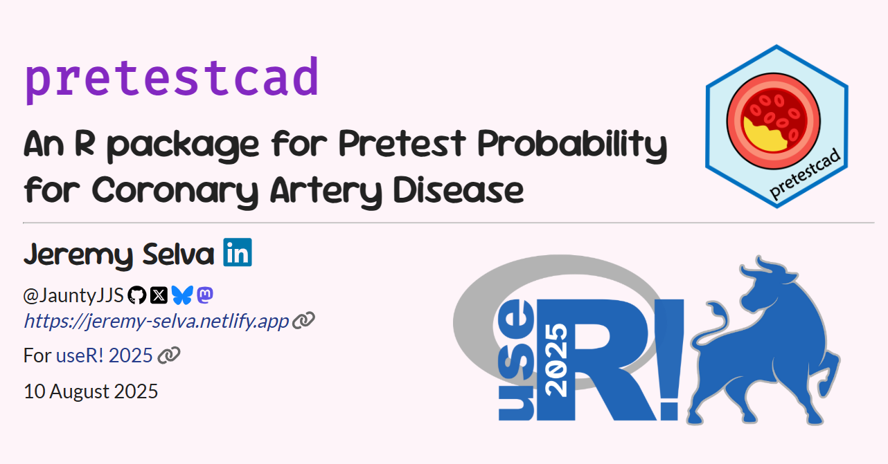

# pretestcad - An R package for Pretest Probability for CAD

Here are the <a href="https://github.com/JauntyJJS/useR-2025_pretestcad"
target="_blank">source code</a> for my
<a href="https://jauntyjjs.github.io/useR-2025_pretestcad/"
target="_blank">slides</a> presented at
<a href="https://user2025.r-project.org/" target="_blank">useR! 2025</a>.

